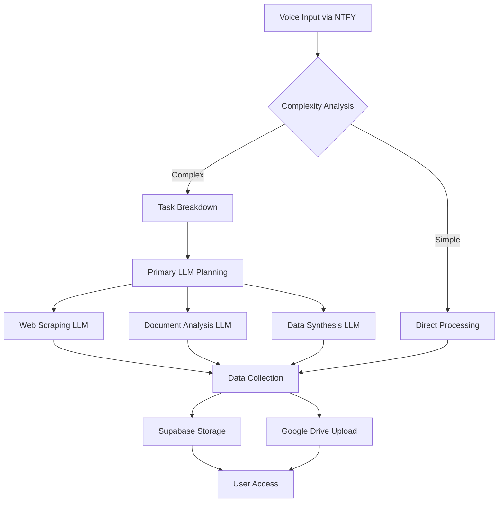
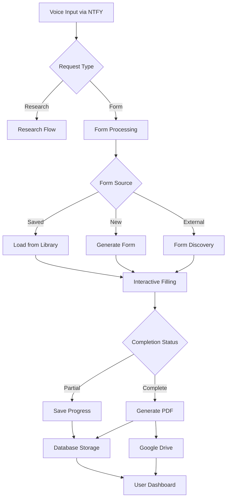

# Parsely-Multi-Large-Documents-Targeted-Research
The Parsely-Targeted-Research-Framework (PTRF) is a sophisticated AI-powered research and analysis system designed to handle complex targeted research tasks across multiple domains. From performing comprehensive financial analysis to consumer research and document processing

# 🎯 Parsely-Targeted-Research-Framework: Your AI-Powered Research and Analysis Companion

## Overview
The Parsely-Targeted-Research-Framework (PTRF) is a sophisticated AI-powered research and analysis system designed to handle complex targeted research tasks across multiple domains. From performing comprehensive financial analysis to consumer research and document processing, PTRF serves as your intelligent research assistant, capable of understanding and executing both simple and complex research queries through various input methods.

## Key Features
- **Advanced Financial Analysis**:
  - Company macro metadata analysis (JPM analyst-level)
  - Comprehensive underwriting assistance
  - Market prospecting and competitive analysis
  - Financial document processing and interpretation

- **Consumer Research Assistant**:
  - Real-time entertainment availability checks
  - Comparative product/service analysis
  - Deal evaluation and price comparison
  - Local service availability tracking

- **Document Processing & Form Assistance**:
  - Intelligent form field recognition and filling
  - Multi-format document analysis
  - Automated form reframing and completion
  - Document type classification and routing

- **Multi-Modal Input Processing**:
  - Voice command interpretation
  - Text-based queries
  - Document/image upload analysis
  - Real-time chat interface

- **Integration & Communication**:
  - NTFY client for free WiFi notifications
  - Twilio integration for phone communications
  - Supabase database connectivity
  - Google Drive integration for research storage
  - Real-time phone messaging capabilities

## Use Cases

### Financial Analysis
- Perform comprehensive company analysis similar to investment banking standards
- Generate detailed market research reports
- Analyze competitive landscapes
- Process financial documents and statements

### Consumer Research
- Find local movie showings and entertainment options
- Compare product specifications and prices across platforms
- Evaluate service offerings and deals
- Track price histories and trends

### Document Processing
- Intelligent form completion and filing
- Document analysis and data extraction
- Automated report generation
- Multi-format document handling

### Real-Time Communications
- Instant research notifications via NTFY
- Phone-based research queries
- Voice command processing
- Research result storage and retrieval

### Form Processing Scenario
#### Voice-Driven Form Completion
1. **Form Initialization**
   User has three options to start form processing:
   - Reference previously uploaded form: "Fill out my saved W-9 form"
   - Request new form creation: "Create a new employee onboarding form"
   - Request form discovery: "Find the latest I-485 immigration form"

2. **Form Acquisition**
   System responds based on request type:
   - **Saved Forms**: Retrieves from user's form library in Supabase
   - **New Forms**: Generates structured form based on requirements
   - **External Forms**: 
     - Searches official sources for latest version
     - Downloads and processes form structure
     - Validates form authenticity

3. **Interactive Form Filling**
   - System initiates conversational form filling:
     ```
     System: "Let's fill out your W-9 form. What's your full legal name?"
     User: "John Michael Smith"
     System: "Thanks. Is your business a sole proprietorship or corporation?"
     User: "Sole proprietorship"
     System: "Got it. What's your current mailing address?"
     ```
   - Handles complex field dependencies
   - Validates input against form requirements
   - Provides field explanations when needed

4. **Progress Management**
   - Saves progress automatically after each field
   - Allows pause/resume at any point:
     ```
     User: "Let's pause here, I'll complete the rest later"
     System: "Progress saved. We've completed 60% of the form, 
             remaining fields: SSN and signature"
     ```
   - Maintains form state in database

5. **Completion Options**
   - **Partial Completion**:
     - Saves current progress
     - Lists remaining required fields
     - Sets reminder for completion
   
   - **Full Completion**:
     - Generates filled form PDF
     - Stores in Google Drive
     - Sends confirmation with access link

6. **Follow-up Actions**
   - Schedules reminders for incomplete forms
   - Notifies of approaching deadlines
   - Suggests related forms if needed
   - Maintains form version history

## Usage Flow Examples

### Complex Research Scenario
#### On-the-Go Research Request
1. **Voice Initiation**
   - User speaks to NTFY app on iPhone while driving
   - System establishes conversation thread and maintains context
   - Research requirements are clarified through natural dialogue

2. **Task Processing**
   - System analyzes request complexity and determines research approach
   - Selects optimal LLM models for different components:
     - Primary LLM: Strategic planning and task breakdown
     - Specialized LLMs: Web scraping, document analysis, data synthesis
   
3. **Research Execution**
   - Performs parallel processing of research components:
     - Web content scraping with screenshot capture
     - Document retrieval and analysis
     - Data compilation and structuring
   - Saves source materials and screenshots for reference
   
4. **Result Storage**
   - Stores structured data in Supabase
   - Uploads comprehensive report to Google Drive
   - Maintains source documentation with timestamps
   
5. **Review Access**
   - User can access full research via:
     - Database dashboard with interactive visualizations
     - Organized Google Drive folder with all sources
     - Chronological conversation history

### Simple Query Scenario
#### Quick Information Lookup
1. **Voice Query**
   - User asks: "What movies are playing tonight at the nearest theater?"
   
2. **Rapid Processing**
   - System identifies as simple query
   - Determines user location
   - Fetches real-time movie schedules
   
3. **Immediate Response**
   - Provides instant voice response with showtimes
   - Includes theater location and booking information
   
4. **Background Storage**
   - Automatically logs query and results to database
   - Creates simple summary document in Google Drive
   - Tags with timestamp and location data

### System Architecture Flow


### System Architecture Flow (Updated)


## Technical Architecture

### Core Components
- `research_engine.py`: Main research orchestration system
- `financial_analyzer.py`: Financial analysis and reporting
- `consumer_research.py`: Product and service comparison
- `document_processor.py`: Document handling and form filling
- `communication_handler.py`: Notification and messaging system

### Integration Points
- Supabase for structured data storage
- Google Drive for document management
- NTFY for notification delivery
- Twilio for phone communications

## Setup Guide

### System Requirements
- Python 3.8+
- Webcam or smartphone camera for document scanning
- 8GB RAM minimum (16GB recommended for optimal performance)

### Installation Steps
1. Set up a virtual environment:
   ```bash
   python -m venv parsely_env
   source parsely_env/bin/activate  # Windows: parsely_env\Scripts\activate
   ```

2. Install dependencies:
   ```bash
   pip install -r requirements.txt
   ```

3. Configure environment:
   Create `.streamlit/secrets.toml` with necessary API keys for translation and vision services.

### Launching the Application
```bash
streamlit run parsely_immigrant_assist.py
```

## Privacy and Security
- End-to-end encryption for all data transmission and storage
- Secure API integrations with financial and third-party services
- Configurable data retention policies
- Optional local-only processing for sensitive data

## Continuous Improvement
- Regular updates to support new research capabilities
- Expanding integration options
- Performance optimization for real-time processing
- Community-driven feature development

The Parsely-Targeted-Research-Framework stands as a powerful research companion, transforming complex analysis tasks into streamlined, automated processes. From financial analysis to consumer research and document processing, PTRF empowers users with AI-driven insights and efficient data processing capabilities.

For more information, documentation, and to join our developer community, visit [Parsely-Targeted-Research-Framework](https://github.com/parsely-research-framework).


`#AI-Driven` `#DocumentProcessing` `#GovernmentForms` `#CitizenServices` `#AutomatedWorkflow`
